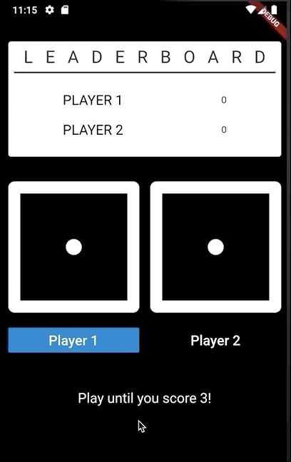

# Dice! Flutter Multiplayer Game 🎲 🚀

## The Game

An example of a multiplayer game with flutter😁 The game is very simple and it was fun to code it. Feel free to improve the game. I really appreciate your PULL REQUEST!

## How it works: 
The game has 5 rounds each. The first player begins to roll the dice. Then the second player rolls the dice. The player with the larger number of dice wins the round. The game ends when a player has won 5 rounds. The current score is displayed on the ranking list. 

## Author 🤓 
**Muhammed Misir**

<a href="https://www.instagram.com/misir_muhammed/">Learn more on Instgram!</a>

